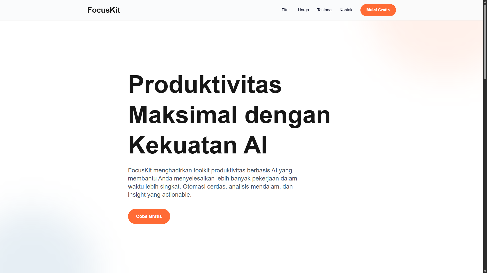
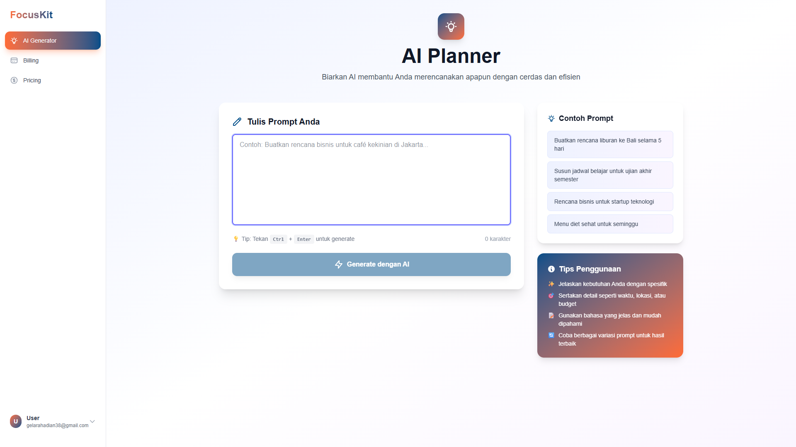
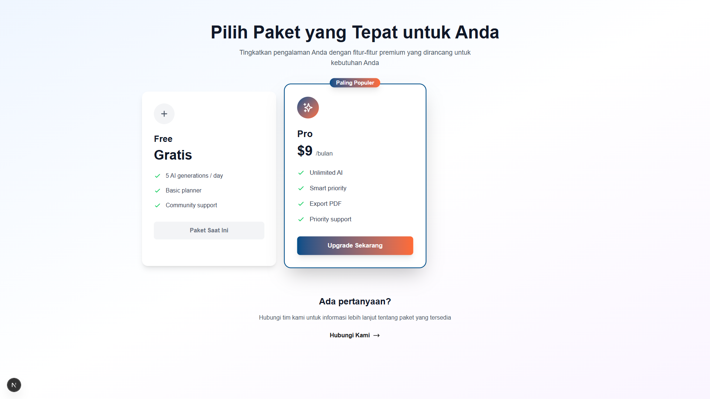
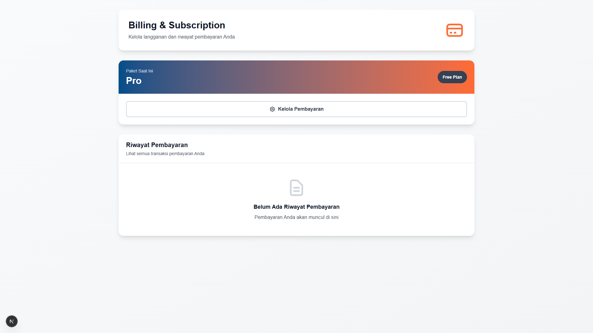
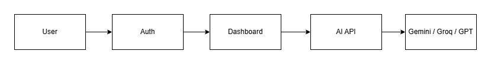
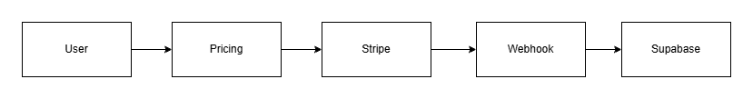

# FocusKit – AI Productivity SaaS
AI-powered productivity toolkit with subscription billing.

## Demo
- Live: https://focus-kit-lar.vercel.app/
- Demo Account:
  - email: gelarahadian38@gmail.com
  - password: Gelarahadian1

## Screenshots
- Landing Page

- AI Generator

- Pricing Page

- Billing Page

## Features
- Authentication (Supabase)
- Subscription Billing (Stripe)
- AI Task Generator (Gemini + Groq Fallback)
- Usage Limit System
- Billing Portal
- Order History
- Error Handling & Loading States

## Tech Stack
- Next.js App Router
- Supabase (Auth & Database)
- Stripe Subscription
- Google Gemini API
- Groq Llama3 (Fallback)
- Tailwind CSS

## Architecture

## Development Approach
This project was built using AI-assisted development.
AI was used to accelerate boilerplate coding, while system
design, architecture, and validation were handled manually.

## Installation
npm install
npm run dev

## Environment Variables
NEXT_PUBLIC_SUPABASE_URL=
NEXT_PUBLIC_SUPABASE_PUBLISHABLE_KEY=
NEXT_PUBLIC_SUPABASE_ANON_KEY=
SUPABASE_SERVICE_ROLE_KEY=

NEXT_PUBLIC_STRIPE_PUBLISHABLE_KEY=
STRIPE_SECRET_KEY=
STRIPE_PRICE_PRO_MONTHLY=
STRIPE_WEBHOOK_SECRET=

OPENAI_API_KEY=
GEMINI_API_KEY=
GROQ_API_KEY=

NEXT_PUBLIC_BASE_URL=
